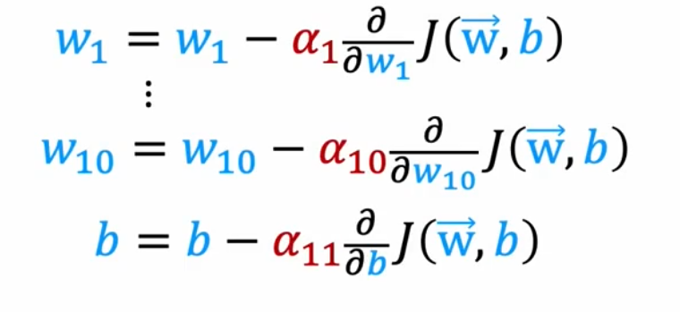

:PROPERTIES:
:ID:       5765135f-eb1d-46f7-ac0d-627582a02b8e
:END:
#+title: Adam Algorithm
#+filetags: ML

Adam: Adaptive Moment Estimation
- adjust the learning rate automatically
- not just single global learning rate $\alpha$

- If $w_j$ (or $b$) keeps moving in same direction, increase $\alpha_j$
- If $w_j$ (or $b$) keeps oscillating, reduce $\alpha_j$

* Code
#+begin_src python
  model = Sequential([...])
  model.compile(optimizer=tf.keras.optimizers.Adam(learning_rate=1e-3) # initial alpha
                loss=tf.keras.losses.SparseCategoricalCrossentropy(from_logits=True))
  model.fit(X, y, epochs=100)
 #+end_src
