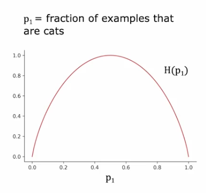
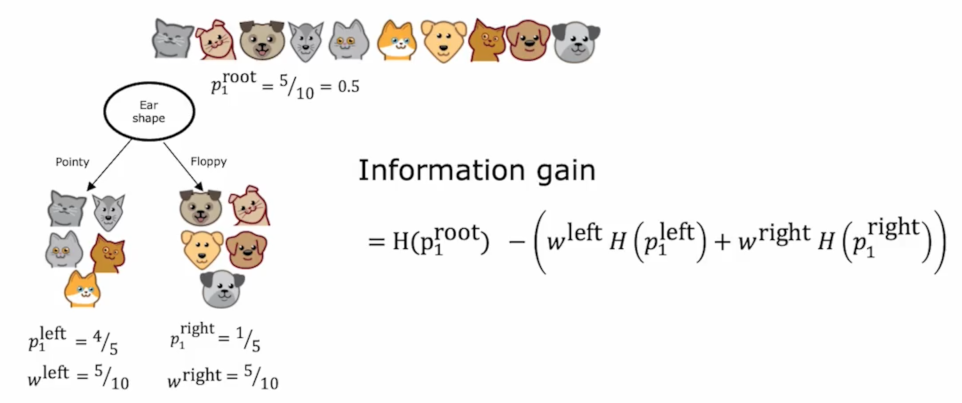
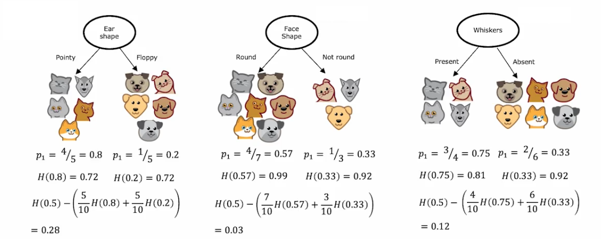
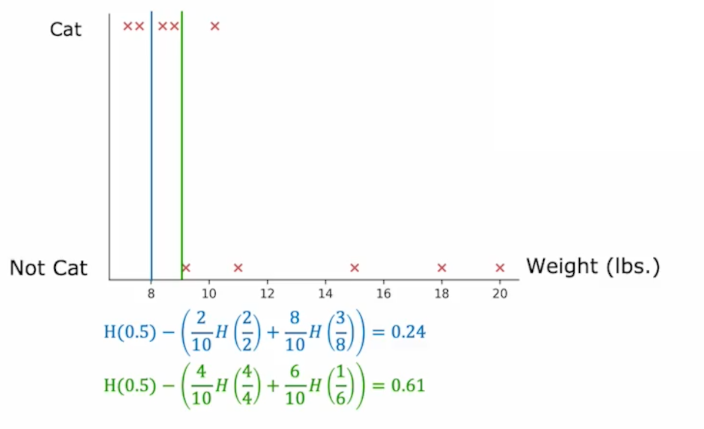
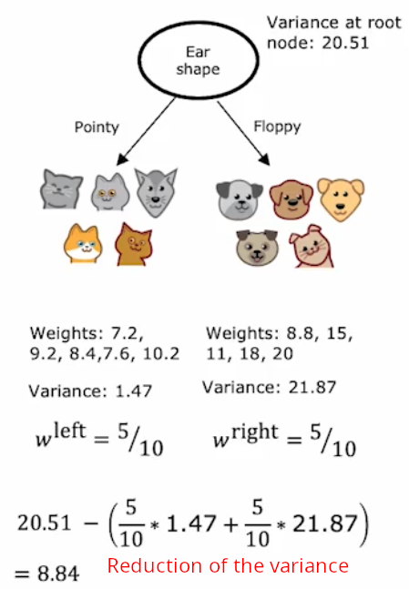

:PROPERTIES:
:ID:       e0a49219-943c-4fba-b790-0b3e365b5e3d
:END:
#+title: Decision Tree
#+filetags: ML

* Learning Process
** How to Choose a Split Feature?
- Maximize purity (or minimize impurity/entropy), (e.g. 98% in one class)

*** Estimate Impurity (Entropy)
- Entropy Function is a measure of the impurity of a set of data.
  - $p_0=1-p_1$
  - $H(p_1)=-p_1 \log_2(p_1)-p_0\log_2(p_0)$

**** Alternative Function
- [[id:45ae2e59-a5f5-4d4e-bdb2-42c4c81a5d40][Gini Criteria]]
*** Key idea
Choose the feature that *reduces impurity(entropy) the most* (Information Gain).

*** Example

- Combining left and right entropy into a single measure by taking the weighted average
- *Parent node entropy* is $H(0.5)=1$ The Reduction in entropy is:
  - $H(0.5)-\text{weighted entropy of sub-trees}$
- Splitting on ear shape results in the biggest *reduction in entropy*. (0.28)

** When to Stop Splitting?
1. When a node is 100% one class
2. Result in the tree exceeding a maximum depth
3. When improvement in purity score are below a threshold
4. When number of examples in a node is below a threshold

* Learning Steps
1. Start with all examples at the root node.
2. Calculate information gain for all possible features, and pick the one with the *highest information gain*.
3. Split dataset according to selected feature, and create left and right branches of the tree.
4. Keep repeating splitting process until stopping criteria is met.
  - When a node is 100% one class
  - When splitting a node will result in the tree exceeding a maximum depth
  - When improvement in purity score are below a threshold. See [[Estimate Impurity (Entropy)][Measure Impurity]].
  - When number of examples in a node is below a threshold

* Non-binary Features
** Categorical Feature
- Use *one hot encoding*
  - If a categorical feature can take on /k/ values, create /k/ binary features (0 or 1 valued).

** Continuous Feature

1. Plotting
2. Trying different thresholds
2. Calculating left and right entropy
3. Calculating the *information gain* (reduction in entropy)

* Generalizing to *Regression Problem*
- Taking an average at the leaf node.
- Choosing a split
  - Reduce the variance instead of entropy(impurity)

* [[id:6f6fe3d6-daff-4dde-94fb-1ce36dc43af3][Tree Ensembles]]
