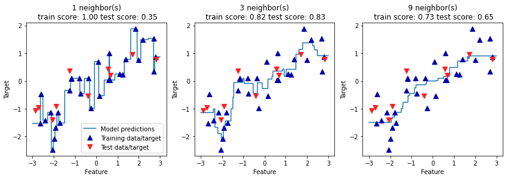

:PROPERTIES:
:ID:       4e603b85-7e9e-47ca-b3f4-b7747cd6019a
:END:
#+title: K-Neighbors Regression
#+filetags: ML

- A regression variant of the k-nearest neighbors algorithm.
- When using multiple nearest neighbors, the prediction is the average, or mean, of the relevant neighbors.

* Code
  #+begin_src python
    import mglearn
    from sklearn.neighbors import KNeighborsRegressor

    # 1 feature, 1 target
    X, y = mglearn.datasets.make_wave(n_samples=40)

    X_train, X_test, y_train, y_test = train_test_split(X, y, random_state=0)

    reg = KNeighborsRegressor(n_neighbors=3)
    reg.fit(X_train, y_train)

    print("Training set accuracy: {:.2f}".format(reg.score(X_train, y_train)))
    print("Test set accuracy: {:.2f}".format(reg.score(X_test, y_test)))
  #+end_src

* Important Parameters
See [[id:4dec577e-c1d9-4b01-9a95-63e3413b42a9][K-Nearest Neighbors]]
** N-Neighbors Comparison

