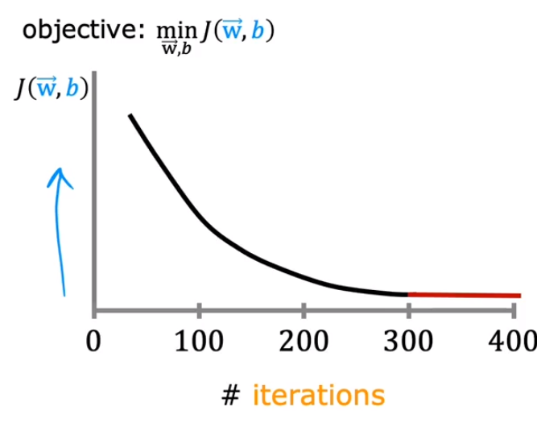
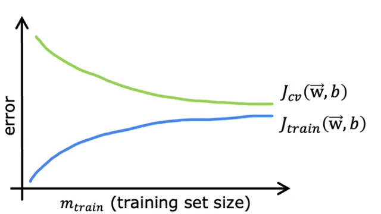
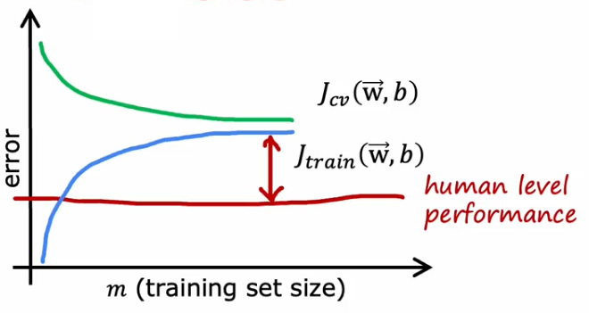
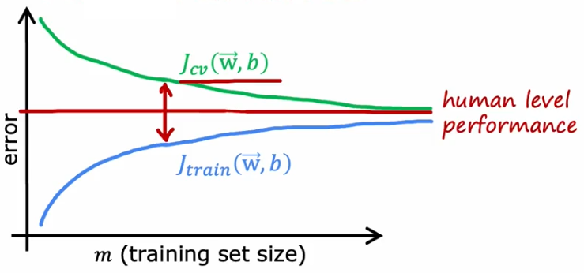

:PROPERTIES:
:ID:       1c60f0fb-302d-4a1c-b95e-a89d533afbe7
:END:
#+title: Learning Curve
#+filetags: ML

* Application
- To identify problem with gradient descent.
- To help determine $\alpha$ and $\epsilon$

* Tips
- If curve not decreases after every iteration
  1. Choose a much smaller learning rate $\alpha$ to see if there is a bug. (debug process)
  2. Choose a appropriate $\alpha$.

* Troubleshooting [[id:4a034a17-5a7f-4003-a2fb-4c833e76cc98][Overfitting/Underfitting]]
** Normal

** High Bias

- Note: Getting more training data will not help much.

** High Variance

- Note: Getting more training data is likely to help.
