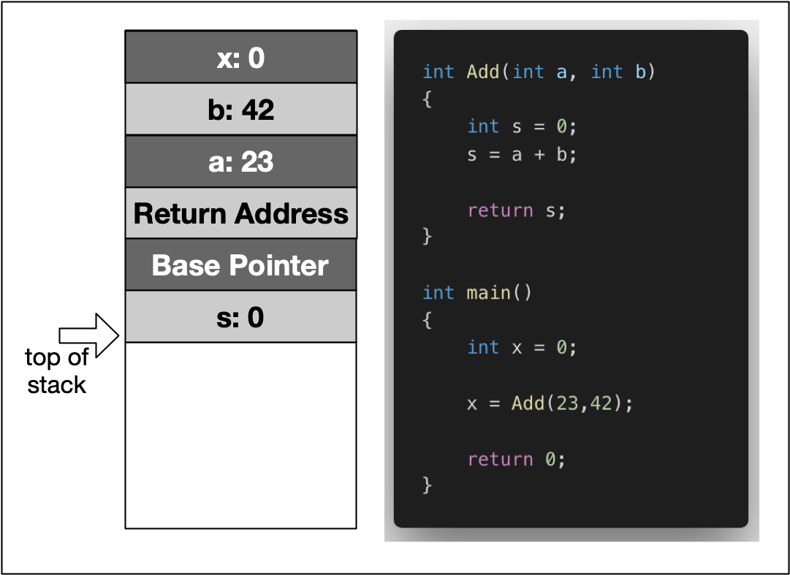

:PROPERTIES:
:ID:       5efa3691-4464-4a11-9d52-1e83016d8bc1
:END:
#+title: Memory Allocation
#+filetags: C++

* Basic Types of Memory Allocation
- Static memory allocation :: is performed for *static* and *global* variables, which are stored in the *BSS and Data segment*. Memory for these types of variables is *allocated once* when your program is run and persists throughout the life of your program.
- Automatic memory allocation :: is performed for *function parameters* as well as *local variables*, which are *stored on the stack*. Memory for these types of variables is allocated when the path of execution enters a scope and freed again once the scope is left.
- Dynamic memory allocation :: is a possibility for programs to request memory from the operating system at runtime when needed. This is the major difference to automatic and static allocation, where the size of the variable must be known at compile time. Dynamic memory allocation is not performed on the limited stack but *on the heap* and is thus (almost) *only limited by the size of the address space*.

* Memory Allocation On Stack
#+DOWNLOADED: screenshot @ 2024-02-14 11:33:03

- Stack Frame :: is a block of memory on the stack that *a function* uses to store its execution context. When the function returns, the stack frame is removed.

* Allocating Dynamic Memory
** ~malloc~ and ~free~
*** Allocation
- header file: =stdlib.h= or =malloc.h=
- ~malloc~ is used to dynamically allocate a single large block of memory with the specified size. It returns a pointer of type *void* which can be cast into a pointer of any form.
- ~calloc~ (Cleared Memory Allocation) is used to dynamically allocate the specified number of blocks of memory of the specified type. *It initializes each block with a default value '0'.*
- ~realloc~ is used to increase/decrease the size.

#+begin_src c
int numElements = 10;
int *p = (int *)malloc(sizeof(int));
int *p2 = (int *)calloc(1, sizeof(int)); // ensure 0x00000000 for 32-bit
int *pArr = (int *)malloc(numElements * sizeof(int));
int *pArr2 = (int *)calloc(numElements, sizeof(int));

int *pResizedArray = (int*)realloc(pArr, 6 * sizeof(int));
pResizedArray[5] = 1;

struct MyStruct {
    int i;
    double d;
    char a[5];
};
MyStruct *pStruct = (MyStruct*)calloc(4,sizeof(MyStruct));

#+end_src

- *If the space for the allocation is insufficient, a NULL pointer is returned.*

*** De-allocation
~free~ can only release memory that has not been released before. Releasing the same block of memory twice will result in an error.
#+begin_src c
free(p)
free(p2)
free(pArr)
free(pArr2)
free(pResizedArray)
#+end_src

** ~new~ and ~delete~
- C++ introduces the operators ~new/delete~ to call *constructor/destructor*
- ~malloc~ is not type safe because it returns *a void pointer* which needs to be cast into the appropriate data type.
- The ~new~ and ~delete~ operators can be overloaded by a class in order to *include optional proprietary behavior*.

*** ~new~
1. Memory is allocated to hold a new object of type ~MyClass~.
2. A new object of type ~MyClass~ is constructed within the allocated memory by calling the constructor of ~MyClass~.

*** ~placement new~
~placement new~ is used to separating allocation from construction for performance optimization. With ~placement new~, we can pass a preallocated memory and construct an object at that memory location.
- no ~delete~ equivalent to ~placement new~
#+begin_src cpp
void *memory = malloc(sizeof(MyClass));
MyClass *object = new (memory) MyClass;

//no `delete` equivalent to `placement new`
object->~MyClass(); // we have to call the destructor explicitly
free(memory);
#+end_src

*** ~delete~
1. The object of type ~MyClass~ is destroyed by calling its destructor.
2. The memory which the object was placed in is deallocated.

*** Overloading ~new~ and ~delete~
**** Syntax
#+begin_src cpp
// syntax
void* operator new(size_t size);
void operator delete(void*);

// 8-bytes overhead to keep track of the allocated blocks of memory
void* operator new;
void operator delete;
#+end_src

**** Reasons for overloading new and delete:
1. The overloaded new operator function allows to *add additional parameters*. Therefore, a class can have multiple overloaded new operator functions.
2. Overloaded the new and delete operators provides an easy way to integrate a mechanism similar to garbage collection capabilities. (such as in Java)
3. By adding *exception handling* capabilities into new and delete.

* Memory Management Problems
** Memory Leaks
- Tool: *Valgrind*, useful parameters:
  - ~--leak-check~: Controls the search for memory leaks when the client program finishes.
  - ~--show-leak-kinds~: controls the set of leak kinds to show. Options are ~definite~, ~indirect~, ~possible reachable~, ~all~ and ~none~.
  - ~--track-origins~: can be used to see where uninitialized values come from.
  - example: ~valgrind --leak-check=full --show-leak-kinds=all --track-origins=yes --log-file=valgrind-out.txt ./a.out~
** Buffer Overruns
#+begin_src cpp
char str[5];
strcpy(str,"BufferOverrun");
printf("%s",str);
#+end_src
** Uninitialized Memory
** Invalid Memory Access
#+begin_src cpp
char *pStr=new char[25];
delete[] pStr;
strcpy(pStr, "Invalid Access");
#+end_src
