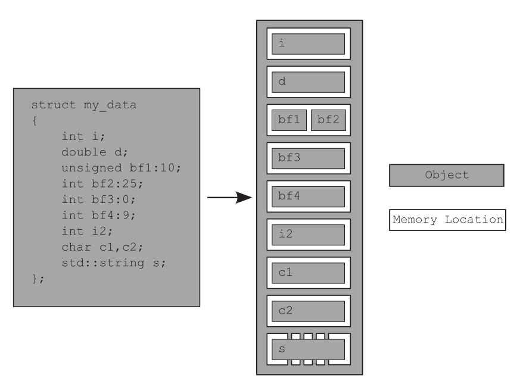

:PROPERTIES:
:ID:       c47f4f7a-d15b-4c9a-8ccb-d00d473059cd
:END:
#+title: C++ Memory Model
#+filetags: C++

* Overview
- All data in a C++ program is made up of *objects*
  - The C++ Standard defines an object as *"a region of storage"*
  - An object is stored in *one or more memory locations*

#+begin_src cpp
#include <iostream>
using namespace std;

struct MyData {
    unsigned int flag:1; // 1bit
    unsigned int sig:1;
    unsigned int sn:4;
    unsigned int reserved:2;
    unsigned int crc:8;
};

int main(int argc, char *argv[]) {
    cout << "sizeof(MyData) = " << sizeof(MyData) << endl;
    return 0;
}
#+end_src

#+RESULTS:
| sizeof(MyData) | = | 4 |
| sizeof(MyData) | = | 4 |

#+DOWNLOADED: screenshot @ 2024-03-01 08:45:38

- The entire struct is one object that consists of several sub-objects
- The ~bf1~ and ~bf2~ bit fields share a memory location
- The ~std::string object s~ consists of several memory locations internally
- The zero-length bit field ~bf3~ separates bf4 into its own memory location, but doesn't have a memory location itself
- Variables of fundamental types occupy exactly one memory location, whatever their size
- Adjacent bit fields are part of the same memory location ~bf1, bf2~

* Class Memory Size
- static members in global scope are stored in the data segment
#+begin_src cpp

#+end_src

* Crucial for Multi-threaded Application
- Everything hinges on those *memory locations*
- If two threads access separate memory locations, there's no problem
- For accessing the same memory location, there has to be an enforced ordering between the accesses
- Once a thread has seen a particular entry in the modification order
  - Subsequent reads from that thread must return later values
  - Subsequent writes from that thread to that object *must occur later in the modification order*.
