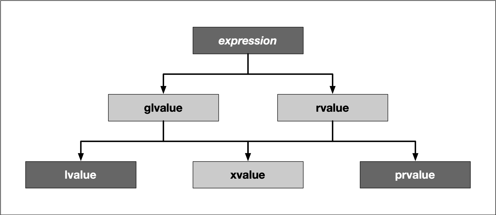

:PROPERTIES:
:ID:       83aa38f7-a6de-42f0-bf0e-b4e2c9114869
:END:
#+title: Move Semantics
#+filetags: C++

* When are move semantics used?
1. Copying heavy-weight objects can be expensive.
2. Ownership needs to be transferred (unique pointers)

* lvalues and rvalues
- Every expression in C++ has a type and belongs to a value category
- There are five value categories since C++ 11
#+DOWNLOADED: screenshot @ 2024-02-14 20:52:48

** lvalues
have an address that can be accessed. They are expressions whose evaluation by the compiler determines the identity of objects or functions.
- An lvalue is an entity that points to a specific memory location.

** prvalues
do not have an address that is accessible directly. They are temporary expressions used to initialize objects or compute the value of the operand of an operator.
- An rvalue is usually a short-lived object.
- Could think of lvalues as *named containers* for rvalues.
#+begin_src cpp
int i = 42;  // lvalue = rvalue;
int *j = &i;
// `&i` generates the address of `i` as an rvalue
// and assigns it to `j`, which is an lvalue holding the memory location of `i`
#+end_src

* lvalue References
An lvalue reference can be considered as an alternative name for an object.
#+begin_src cpp
int &j = i; // lvalue reference j
void myFunction(int &lval) { ++lval; } // lvalue reference val
// myFunction(42); // Error: 42 is an rvalue
// myfunction(i+j); // Error: i+j is an rvalue
#+end_src

* rvalue References
#+begin_src cpp
int i = 1;
int j = 2;

int &&l = i + j; // l is an rvalue reference, and an lvalue

void myFunction(int &&rval) { cout << val << endl; };
myFunction(i + j); // prints 3
#+end_src
- Important Aspect: *rvalue references are themselves lvalues*

* Move
#+begin_src cpp
#include <iostream>
using namespace std;

void myFunction(int &&val) {
    // val itself is an lvalue
    std::cout << "val = " << val << std::endl;
}

int main() {
    myFunction(42);

    int i = 23;
    myFunction(std::move(i)); // ownership changes
    // we shall never use i anymore !
    // even though we could try to access it.

    return 0;
}
#+end_src

** ~std::move~
- ~std::move~ converts lvalue into an rvalue(actually *xvalue*)
- By using ~std::move~ we can force the compiler to use move semantics.

* The Rule of Five
The Rule of Five states that if you have to write one of the functions listed below then you should consider implementing all of them with a proper resource management policy in place.
1. destructor
2. copy constructor
3. assignment operator
4. move constructor
5. move assignment constructor
