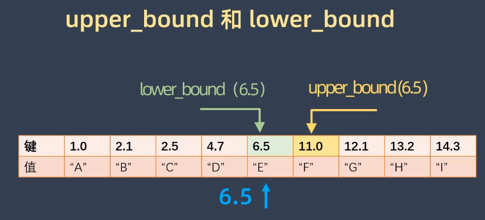

:PROPERTIES:
:ID:       0dfcccd6-da50-4f8c-af79-69017dcb3bcd
:END:
#+title: ~std::map~

* Declaration
#+begin_src cpp
template<class Key,
  class T,
  class Compare = std::less<Key>,
  class Allocator = std::allocator<std::pair<const Key, T>>>>
class map;
#+end_src

* Lookup Methods
- ~find~, ~equal_range~, ~lower_bound~, ~upper_bound~, ~count~

