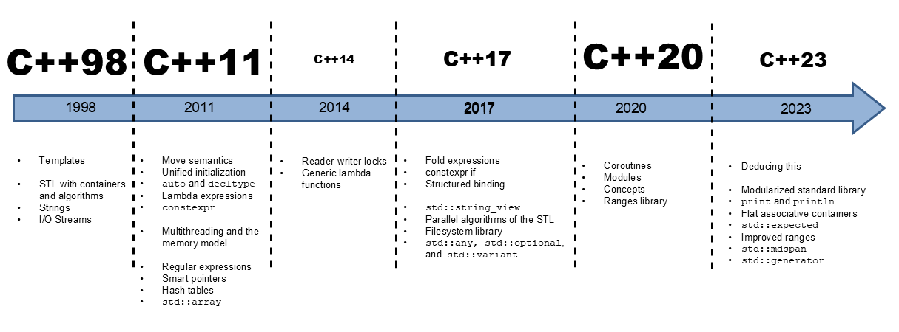
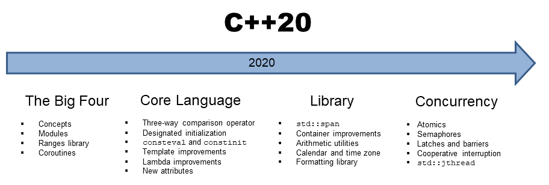

:PROPERTIES:
:ID:       de67ad04-b348-4367-9a6f-88404e0f38b0
:END:
#+title: STL
#+filetags: C++

* Changes

** C++ 20

* STL General
:PROPERTIES:
:ID:       f4caef98-2ec3-4fe7-89dc-6b635677862d
:END:
- [[id:02e09a1c-a8c8-4102-a444-0498e8dfb993][~std::initializer_list~]]

* STL I/O
- [[id:2eb32af4-4617-48c6-a5cb-d945ff3e494d][~std::istringstream~]]

* STL Data Structures
:PROPERTIES:
:ID:       20ab4a25-85ff-4006-9a6d-47863362bd2f
:END:
** Sequential Containers
- [[id:cbc6a2ee-feed-4f66-9558-1bd77b535c3f][~std::array~]]: replacement for C-style arrays
- [[id:a2807e14-ea95-4d42-aa97-eebdc0798c95][~std::vector~]]
- ~std::list~: double-linked list
- [[id:41c864cb-fcac-4b1d-ac88-08ca0471045c][~std::deque~]]

** Associative Containers
- ~std::set~
- [[id:0dfcccd6-da50-4f8c-af79-69017dcb3bcd][~std::map~]], ~std::multimap~
- [[id:2d29f137-6278-4364-b0dc-2307410589a1][~std::unordered_map~]]

** [[id:d6893378-aac5-4435-8cac-980bcf7fc95d][Iterator]]

* STL Functional
:PROPERTIES:
:ID:       7284b140-b1c6-443b-841a-8b07acde4ab5
:END:
- [[id:9dd5fcd3-584a-410d-8aed-16eadfd19ccc][~std::function~]]
- [[id:ca728cfa-e55e-4bf7-bb1b-d9c251fdc6a5][~std::bind~]]
- [[id:92eefd58-3653-4a53-9947-c2d375d8fe69][~std::mem_fn~]]

* [[id:7c79b159-d595-4be4-b2ad-d322177c6dde][STL Concurrency]]
* [[id:a370c3b2-547e-4ab7-8f39-86c57d8cbfee][STL Algorithms]]
* [[id:442b8404-f5ba-4449-8fdd-e5d362ede5bb][Modern STL Evolution]]
