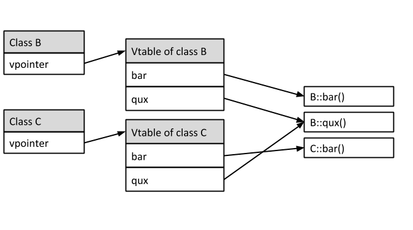

:PROPERTIES:
:ID:       9bb46372-40a5-416c-9a00-b00009a3e663
:ROAM_ALIASES: "Virtual Tables"
:END:
#+title: VTables

* Overview
- Dispatching of virtual functions needs to happen at runtime
- The virtual table method is a popular implementation of dynamic dispatch
- For every class that defines or inherits virtual functions the compiler creates a virtual table
  - All the objects of that class share the same virtual table
- The first address of the object is the vpointer pointing to the virtual table

* Code Demonstration
#+begin_src cpp
#include <iostream>
class Base {
public:
  virtual void foo() { std::cout << "Base::foo()" << std::endl; }
};

class Derived : public Base {
public:
  void foo() override { std::cout << "Derived::foo()" << std::endl; }
};

int main() {
  Base base;
  Derived derived;

  using VFuncPtr = void *;
  using VTablePtr = VFuncPtr *;
  using VPtr = VTablePtr *;

  using FooPtr = void (*)(void *);

  auto vptr = reinterpret_cast<VPtr>(&base);               // VPtr = void**
  auto vtable = reinterpret_cast<VTablePtr>(*vptr);        // VTablePtr = void**
  auto vfirstfunc = reinterpret_cast<VFuncPtr>(vtable[0]); // FooPtr = void*
  auto foo = reinterpret_cast<FooPtr>(vfirstfunc); // FooPtr = void (*)(void*)
  foo(&base);
  return 0;
}
#+end_src

#+RESULTS:
: Base::foo()
