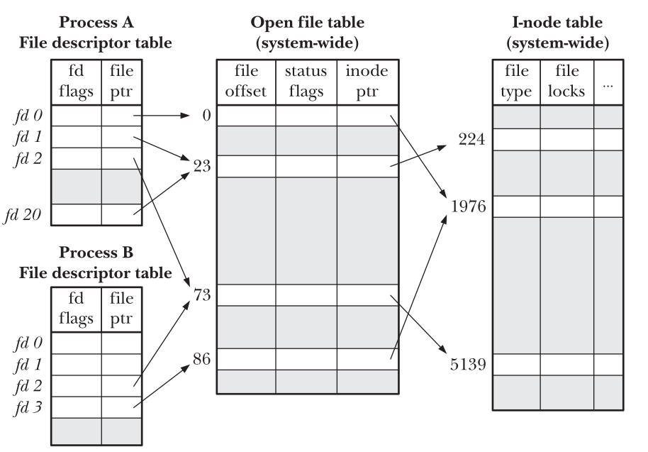

:PROPERTIES:
:ID:       dfdba3bb-da7c-4630-93e1-a82b5462795c
:END:
#+title: [SC] I/O
#+filetags: :SystemCall:

* Basic I/O
** Overview
- ~open()~: ~fd = open(pathname, oflags, mode)~
- ~read()~: ~numread = read(fd, buffer, count)~
- ~write()~: ~numwrite = write(fd, buffer, count)~
- ~close()~: ~status = close(fd)~
- ~lseek()~: ~offset = lseek(fd, offset, whence)~

** Declaration
#+begin_src cpp
  #include <sys/stat.h>
  #include <fcntl.h>
  int open(const char *pathname, int flags, ... /* mode_t mode */);
  int creat(const char *pathname, mode_t mode);

  #include <unistd.h>
  ssize_t read(int fd, void *buffer, size_t count);
  ssize_t write(int fd, const void *buffer, size_t count);
  int close(int fd);
  off_t lseek(int fd, off_t offset, int whence);

  // Operations Outside the Universal I/O Model
  #include <sys/ioctl.h>
  int ioctl(int fd, int request, ...);
#+end_src

** ~open~, ~openat~, ~creat~
- ~fd = open(pathname, oflags, mode)~
- ~fd = openat(fd, pathname, oflags, mode)~: 在指定目录或当前工作目录使用相对路径打开文件
- ~fd = creat(path, mode)~: 早期 Linux ~open~ 无法创建新文件时使用
  - 等价于 ~fd = open(path, O_WRONLY | O_CREAT | O_TRUNC, mode)~
- 特殊的 flag:
  - =O_DIRECT=: 无缓冲输入输出
  - =O_ASYNC=: 当 IO 操作可行时，产生信号通知进程
  - =O_DSYNC=: 提供同步的 IO 数据完整性
  - =O_NONBLOCK=: 以非阻塞方式打开
  - =O_SYNC=: 以同步方式写入文件

** An Example
#+begin_src cpp
  #define BUFFSIZE 4096
  #include <fcntl.h>
  #include <stdio.h>
  #include <unistd.h>

  int main(int argc, char *argv[]) {
    int n = 0;
    char buf[BUFFSIZE];

    while ((n = read(STDIN_FILENO, buf, BUFFSIZE)) > 0) {
      if (write(STDOUT_FILENO, buf, n) != n) {
        perror("write error");
      }
    }
    if (n < 0) {
      perror("read error");
    }
    return 0;
  }
#+end_src

* More I/O Operations
| Operation          | Description                                               |
|--------------------+-----------------------------------------------------------|
| ioctl              | Operations outside the universal I/O                      |
| dup/dup2           | Duplicate a file descriptor                               |
| fcntl              | File control operations                                   |
| pread/pwrite       | File I/O at a specified offset                            |
| readv/writev       | Transfer multiple buffers of data in a single system call |
| truncate/ftruncate | Truncate a File                                           |
| mkstemp/tmpfile    | Create temporary files                                    |

** ~dup~ and ~dup2~
Duplicate a [[id:937b44b4-497a-466a-924d-0a01a2228266][File Descriptor]].
- ~dup(fd)~ is equivalent to ~fcntl(fd, F_DUPFD, 0)~
- ~dup2(fd, fd2)~ is equivalent to ~close(fd2); fcntl(fd, F_DUPFD, fd2)~. (*atomic* operation)

** ~sync~, ~fsync~, and ~fdatasync~
- ~void sync(void)~: simply queues all the modified block buffers for writing and returns.
- ~int fsync(int fd)~: waits for the disk writes to complete before returning
  - is used when an application needs to be sure that the modified blocks have been written to the disk.
- ~int fdatasync(int fd)~: is similar to ~fsync~, but it doesn't affect the file's attributes.

** ~fcntl()~
Features
1. Duplicate an existing descriptor (cmd =F_DUPFD= or =F_DUPFD_CLOEXEC=)
2. Get/set file descriptor flags (cmd =F_GETFD= or =F_SETFD=)
3. Get/set file status flags (cmd =F_GETEL= or =F_SETFL=)
4. Get/set asynchronous IO ownership (cmd =F_GETOWN= or =F_SETOWN=)
5. Get/set record locks (cmd =F_GETLK=, =F_SETLK=, or =F_SETLKW=)
*** 适用场景
常用用途：修改 *file status flags*
- 文件不是由调用程序打开的，比如标准输入输出
- 文件描述符的获取是通过 ~open()~ 之外的系统调用，比如 ~pipe()~, ~socket()~ 调用
#+begin_src cpp
  int flags;

  flags = fcntl(fd, F_GETFL);
  if (flags == -1)
    perror("read flags error");
  flags |= O_APPEND;
  if (fcntl(fd, F_SETFL, flags) == -1)
    perror("set flags error");
#+end_src

* I/O Details
** Open File Table
:PROPERTIES:
:ID:       cdcabfaf-31e1-4a52-865a-f65eea108602
:END:
Three data structures involves:
- the per-process *file descriptor table*;
- the system-wide table of *open file descriptions*
- the file system *i-node table*.

#+DOWNLOADED: screenshot @ 2024-02-21 14:17:25

** Nonblocking I/O
:PROPERTIES:
:ID:       2fff5bbd-ea0a-46ec-9353-f9f133786ae4
:END:
~O_NONBLOCK~ flag details:
- If the file can't be opened immediately, then ~open()~ returns an error instead of
blocking.
- After a successful ~open()~, subsequent I/O operations *are also nonblocking*.
- Can be used with devices, pipes, FIFOs, and sockets.
- ~O_NONBLOCK~ is generally ignored for regular files
  - because the kernel buffer cache ensures that I/O on regular files does not block.

* =/dev/fd=
:PROPERTIES:
:ID:       02b1924c-8757-4514-b903-c78f7ccbb83b
:END:
For each process, the kernel provides the special virtual directory ~/dev/fd~.
- =/dev/fd/n=: n is a number corresponding to one of the open file descriptors for the process.
  - =/dev/fd/0= is standard input for the process.
- =/dev/fd= -> =/proc/self/fd= -> =/proc/PID/fd=
- The most common use of files in the =/dev/fd= is in the shell not in programs.
  - =/dev/stdin=, =/dev/stdout=, and =/dev/stderr= are provided as symbolic links.

#+begin_src c
fd = open("/dev/fd/1", O_WRONLY); // standard output
#+end_src
