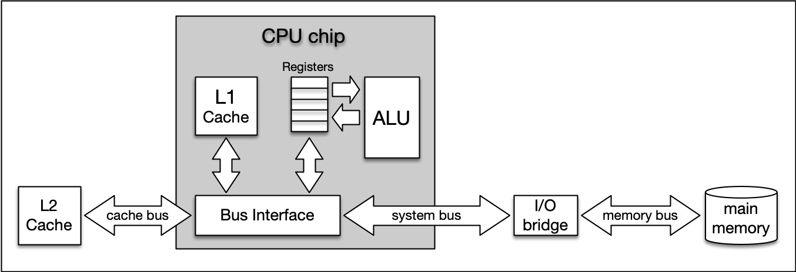
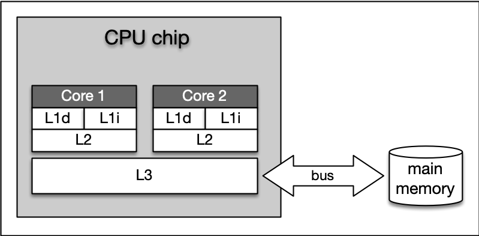
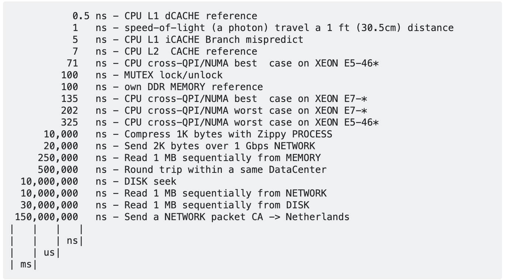

:PROPERTIES:
:ID:       d734bb0e-c8fc-4cd7-a1d9-5432aed0c7d0
:END:
#+title: OS Memory Hierarchy
#+filetags: :Hardware:

* Diagram

#+DOWNLOADED: screenshot @ 2024-01-19 16:51:43

The central CPU chip is connected to the outside world by a number of buses. There is a cache bus, which leads to a block denoted as L2 cache, and there is a system bus as well as a memory bus that leads to the computer main memory. The latter holds the comparatively large RAM while the L2 cache as well as the L1 cache are very small with the latter also being a part of the CPU itself.

** Multi-Core

#+DOWNLOADED: screenshot @ 2024-01-19 16:54:23

* Caches
:PROPERTIES:
:ID:       9a304aa0-a543-4958-8a37-13d1a8a0d293
:END:
** Level-1 Cache
Level 1 cache is the fastest and smallest memory type in the cache hierarchy. In most systems, the L1 cache is not very large. Mostly it is in the range of *16 to 64 kBytes*, where the memory areas for instructions and data are separated from each other (L1i and L1d, where "i" stands for "instruction" and "d" stands for "data".). The importance of the L1 cache grows with increasing speed of the CPU.

In the L1 cache, the most frequently required instructions and data are buffered so that as few accesses as possible to the slow main memory are required. This cache avoids delays in data transmission and helps to make optimum use of the CPU's capacity.

** Level-2 Cache
Level 2 cache is located close to the CPU and has a direct connection to it. The information exchange between L2 cache and CPU is managed by the L2 controller on the computer main board.

The size of the L2 cache is usually at or below *2 megabytes*.

On modern multi-core processors, the L2 cache is often located within the CPU itself.

*The choice* between a processor with more clock speed or a larger L2 cache can be answered as follows: With a higher clock speed, individual programs run faster, especially those with high computing requirements. As soon as several programs run simultaneously, a larger cache is advantageous. Usually normal desktop computers with a processor that has a large cache are better served than with a processor that has a high clock rate.

** Level-3 Cache
Level 3 cache is *shared among all cores of a multi-core processor*.

With the L3 cache, the cache coherence protocol of multi-core processors can work much faster.
This protocol *compares the caches of all cores* to *maintain data consistency* so that all processors have access to the same data at the same time.

The L3 cache therefore has less the function of a cache, but is intended to simplify and *accelerate* the *cache coherence protocol* and the *data exchange between the cores*.

** ~lscpu | grep cache~
** Cache Speed

#+DOWNLOADED: screenshot @ 2024-01-19 19:06:22

