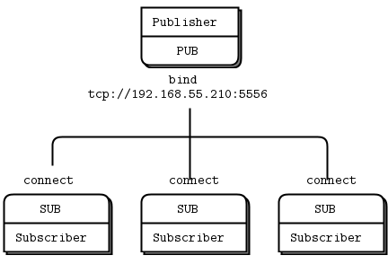
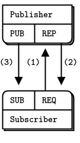
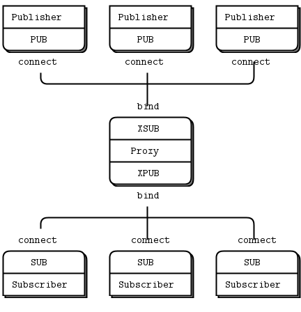
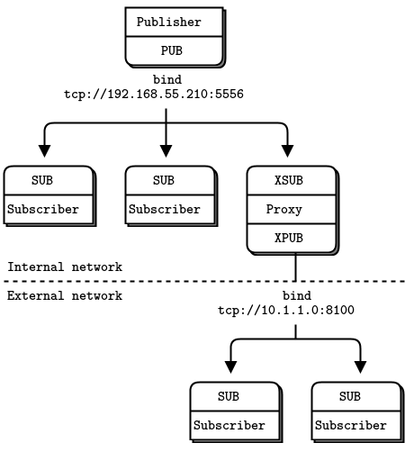
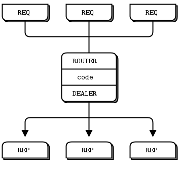
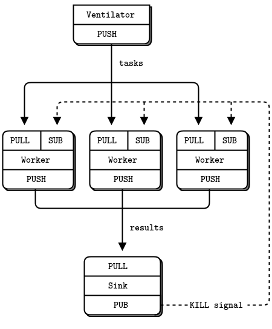
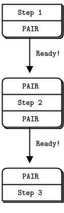

:PROPERTIES:
:ID:       b09fb519-4748-44bb-b38d-5ba9f0c77ddf
:END:
#+title: ZeroMQ
#+filetags: :Network:

* Patterns
- PUB and SUB
- REQ and REP
- REQ and ROUTER (take care, REQ inserts an extra null frame)
- DEALER and REP (take care, REP assumes a null frame)
- DEALER and ROUTER
- DEALER and DEALER
- ROUTER and ROUTER
- PUSH and PULL
- PAIR and PAIR

* PUB and SUB
** Small-scale

** Pub-Sub Synchronization

** Using XSUB and XPUB

** Pub-Sub Forwarder Proxy

* REQ and REP
** Extended Request-Reply

* PUSH and PULL
** Parallel Pipeline with Kill Signaling

* PAIR and PAIR
** Signaling Between Threads

