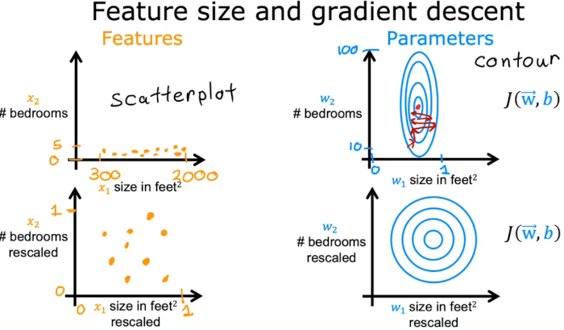

:PROPERTIES:
:ID:       8dc25af2-f3bd-4ec4-b949-40958e167e75
:END:
#+title: Feature Scaling
#+filetags: :ML:

* Why?

* Methods
** Min-Max Scaling
\[x_{scaled}^{(j)}=\frac{x^{(j)}-min(\bm{x})}{max(\bm{x})-min(\bm{x})}\]

** Mean Normalization
\[x_{scaled}^{(j)}=\frac{x^{(j)}-\mu_x}{max(\bm{x})-min(\bm{x})}\]

** Z-score Normalization
\[x_{scaled}^{(j)}=\frac{x^{(j)}-\mu_x}{\sigma_x}\]
- ~StandardScaler~

* Models Affected by Scaling
- Supervised
  - [[id:b6f03e6b-8850-4f2d-8d2d-f337029fe1e7][Linear Regression]]
  - [[id:9db494ed-d782-4bfe-b9d2-52c768251490][Logistic Regression]]
  - [[id:31b71a06-0592-444b-b410-916ee717b488][Neural Network]]
- Unsupervised
  - [[id:0c0f78bc-53e0-44da-b701-3a008d764419][K-Means]]
  - [[id:4dec577e-c1d9-4b01-9a95-63e3413b42a9][KNN]]

* Python Code
- ~StandardScaler~ and Model have similar methods
  - Scaler: ~fit()~ / ~transform()~
  - Model: ~fit()~ / ~predict()~
- Perform two steps: scaling, then model fit
  - Use ~sklearn~ pipeline to combine multiple steps
#+begin_src python
from sklearn.preprocessing import StandardScaler
from sklearn.cluster import KMeans
from sklearn.pipeline import make_pipeline

scaler = StandardScaler()
kmeans = KMeans(n_clusters=3)
pipeline = make_pipeline(scaler, kmeans)
pipeline.fit(samples)

labels = pipeline.predict(samples)
#+end_src
