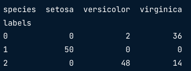
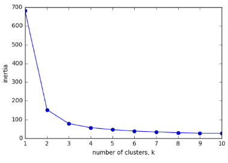

:PROPERTIES:
:ID:       0c0f78bc-53e0-44da-b701-3a008d764419
:END:
#+title: K-Means
#+filetags: ML

* Python Code
** Model
#+begin_src python
from sklearn.cluster import KMeans

# may show plot before to determine number of clusters
model = KMeans(n_clusters=3)
model.fit(samples)

labels = model.predict(new_samples)

# show plot (two features)
xs = new_samples[:,0]
ys = new_samples[:,2]
plt.scatter(xs, ys, c=labels, alpha=0.5)

centroids = model.cluster_centers_
centroids_x = centroids[:,0]
centroids_y = centroids[:,2]
# marker: Diamond, marker size: 50
plt.scatter(centroids_x, centroids_y, marker='D', s=50)

plt.show()
#+end_src

** Evaluating a Clustering
*** Direct Approach
- check correspondence with e.g. iris species
- cross tabulation with pandas
#+begin_src python
import pandas as pd

df = pd.DataFrame({'labels': labels, 'species': species})
ct = pd.crosstab(df['labels'], df['species'])
print(ct)
#+end_src

*** No Species to Check
- Measure quality of a clustering
  - Using only samples and their cluster labels
  - A good clustering has tight clusters
    - i.e. *Samples in each cluster are bunched together, not spread out.*
    - Measures how spread out the clusters are (lower is better)
    - Distance from each sample to centroid of its cluster. check ~inertia_~ attribute

- Inform choice of ~n_clusters~
  - Tradeoffs: low inertia, but not too many clusters!(overfitting)
  - Choose an "elbow" in the inertia plot. Point where the inertia begins to decrease more slowly.
  - 3 is a good choice for Iris example
#+begin_src python
ks = range(1, 6)
inertias = []

for k in ks:
    model = KMeans(n_clusters=k)
    model.fit(samples)
    inertias.append(model.inertia_)

plt.plot(ks, inertias, '-o')
#+end_src
