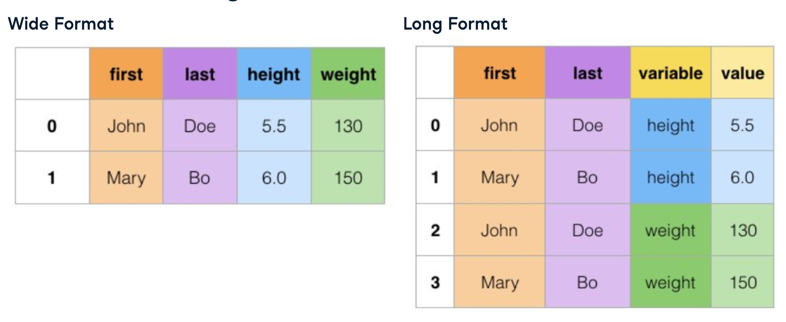

:PROPERTIES:
:ID:       0ee22c36-ad34-4f8e-bfdd-c7e902657f1c
:END:
#+title: Pandas Advanced
#+filetags: :Pandas:

* Aggregating
- ~size()~
- ~mean()~, ~median()~, ~mode()~
- ~min()~, ~max()~, ~cummin()~, ~cummax()~
- ~var()~, ~std()~
- ~sum()~, ~cumsum()~, ~cumprod()~
- ~quantile()~

** ~agg()~
- Calculating [[id:881a87d5-754b-4791-b398-3345c88fdcb2][IQR]]
#+begin_src python
def iqr(column):
    return column.quantile(0.75) - column.quantile(0.25)

df.agg([np.median, iqr])
#+end_src

** Grouped Aggregating
| Feature        | ~groupby~               | ~pivot_table~                |
|----------------+-------------------------+------------------------------|
| *Primary Use*  | Complex transformations | Presentation-ready summaries |
| *Output Shape* | Long (vertical/stacked) | Wide (cross-tabulated)       |
| *Performance*  | Faster                  | Slower (higher overhead)     |

*** Using ~groupby~
#+begin_src python
dogs.groupby("color", as_index=False)["weight"].mean()
dogs.groupby("color")["weight"].agg(["mean", "std", "count"])
dogs.groupby(["color", "breed"])["weight", "height"].mean()
dogs.groupby("color").agg({"weight": ["mean", "std"], "height": ["mean", "std"]})

# named summary columns
dogs.groupby("color").agg(weight_mean=("weight", "mean"), weight_std=("weight", "std"))
#+end_src

*** using ~pivot_table~
#+begin_src python
# get grouped summary by pivoting table
import numpy as np
dogs.pivot_table(index="color", values="weight", aggfunc=[np.mean, np.median]) # by deafult aggfunc=np.mean
# equivalent to dogs.groupby(["color", "breed"])["weight"].mean()
dogs.pivot_table(index="color", columns="breed", values="weight", aggfunc=np.mean, fill_value=0, margins=True)
# margin=True to get total summary row and column

mean_weight_by_color = dogs.pivot_table(index="color", values="weight", aggfunc=np.mean)
mean_weight_by_color.mean(axis="index") # mean of each column
mean_weight_by_color.mean(axis="columns") # mean of each row
#+end_src

* Sampling
#+begin_src python
die = pd.DataFrame({"number": [1, 2, 3, 4, 5, 6],
                    "prob": [1/6, 1/6, 1/6, 1/6, 1/6, 1/6]})
rolls_10 = die.sample(10, replace=True) # replace=True allows for duplicates
#+end_src

* Merging
#+begin_src python
df1.merge(
    df2,
    on="key",
    how="inner",
    selfuffixes=("_df1", "_df2"),
    validate="one_to_one",  # check if the merge keys are unique in both dataframes
)

# Semi join: keep only the rows in df1 that have a match in df2
df1[df1["id"].isin(df2["id"])]

# Anti join: keep only the rows in df1 that do not have a match in df2
df1[~df1["id"].isin(df2["id"])]
#+end_src
- ~merge(validate="one_to_many")~: Check if the merge keys are unique in the left dataframe but not in the right dataframe
  - ~validate~ is useful, because real world data is often *NOT* clean
  - then *Fix incorrect data* or *Drop duplicate rows*

* Concatenating
#+begin_src python
# Concatenate
pd.concat([df1, df2],
          axis=0, # 0: vertical, 1: horizontal
          ignore_index=True, # reset index
          keys=["from_df1", "from_df2"], # create a hierarchical index to track the origin table
          sort=False, # do not sort the columns (default is True)
          )

pd.concat([df1, df2],
          join="inner", # keep only the columns that are in both dataframes, default is "outer"
          varify_integrity=True, # check if the indexes are unique
          )
#+end_src
- ~concat(varify_integrity=True)~: Check if the indexes are unique

* Wide/Long Format Reshaping

- pivot(long->wide):
  - ~df.pivot(index=["first", "last"], columns="variable", values="value")~
- unpivot(wide->long):
  - ~df.melt(id_vars=["first", "last"], value_vars=["height", "weight"], var_name="variable", value_name="value")~
#+begin_src python
#    Australia   Spain   France   UK   USA
# 0      24.6     46.7     22.2  21.2  100.5

df = pd.melt(df, var_name="Country", value_name="population")
#+end_src

* [[id:c73b007a-f41e-4f9e-b2b9-41be79452544][Manipulating Categorical Data]]
* [[id:c3f9e9e6-b7ed-45f0-86a5-35c8e84d96f9][Pandas Timeseries]]
