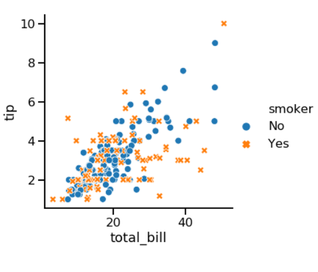
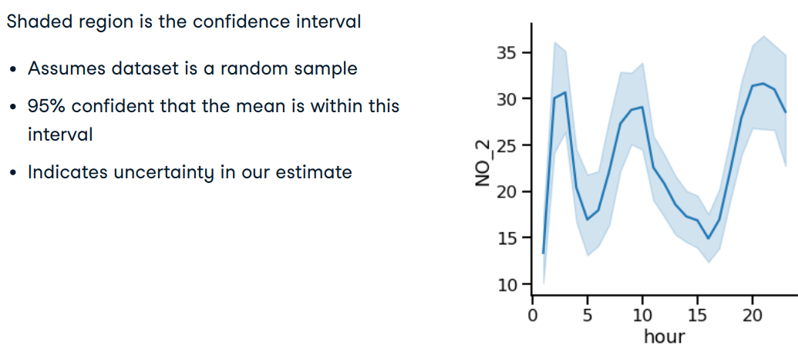
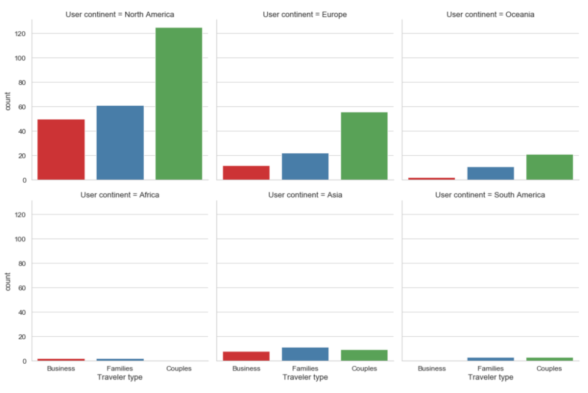
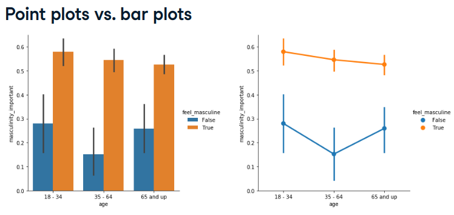

:PROPERTIES:
:ID:       f86e4126-bb1a-45f1-b9b7-b00c2d98672e
:ROAM_ALIASES: sns
:END:
#+title: Seaborn
#+filetags: :Python:DataScience:

* Overview
- Easy way to create the most common types of plots
- Works well with [[id:05ef9aaa-7fa2-45b4-9ed9-d8d01c8abff2][pandas]]
- Built on top of [[id:c78f636f-88e8-4cb8-8e28-0dc34bfbaf3a][matplotlib]]
- Samual Norman Seaborn (sns) from "The West Wing" TV show
  - ~import seaborn as sns~

* Simple Examples
#+begin_src python
import seaborn as sns
import matplotlib.pyplot as plt

sns.scatterplot(x='height', y='weight', data=df)
sns.countplot(x='gender', data=df) # bar plot
#+end_src

* Subgroups Comparison ~hue~
#+begin_src python
import pandas as pd
import seaborn as sns
tips = sns.load_dataset('tips')

hue_colors = {'Yes': 'black', 'No': 'red'}

sns.scatterplot(x='total_bill', y='tip',
                data=tips, hue='smoker',
                hue_order=['Yes', 'No'],
                palette=hue_colors)
#+end_src

* Relational Plots ~relplot()~
- Why use ~relplot()~ instead of ~scatterplot()~?
  - ~relplot()~ lets you create subplots in a single figure
#+begin_src python

sns.relplot(x='total_bill', y='tip', data=tips, kind='scatter',
            col="smoker", # separate plots by smoker
            row="time", # separate plots by time
            )
# useful options: col_wrap, col_order, row_orderns
#+end_src

** Scatter Plots
- Customization:
  - Subplots (~col~ and ~row~)
  - Subplots with color (hue)
  - Subgroups with point size, style and transparency
  - Changing point transparency
- Adding trendline: ~sns.lmplot()~, ~sns.regplot~ using linear regression

** Examples
- Point Size:
  - ~sns.relplot(x='total_bill', y='tip', data=tips, kind='scatter', size='size', hue='size')~
  [[file:images/screenshots/Scatter_Plots/2024-11-09_22-43-31_screenshot.png]]

- Point Style
  - ~sns.relplot(x='total_bill', y='tip', data=tips, kind='scatter', hue='smoker', style='smoker')~

** Line Plots
#+begin_src python
sns.relplot(x='hour', y='NO_2_MEAN', data=air_df_loc_mean,
            kind='line', markers=True, dashes=False,
            hue='location', style='location', # subgroups by location
            )
#+end_src
[[file:images/screenshots/Line_Plots/2024-11-09_22-53-28_screenshot.png]]

- Multiple observations per x-value
  - ~sns.relplot(x='hour', y='NO_2', data=air_df, kind='line')~
  - Replacing CI with std: ~ci='sd'~
  - Turn off the CI: ~ci=None~

* Categorical Plots ~catplot()~
- Used to create categorical plots
- Same advantages of ~relplot()~
- Easily create subplots with ~col=~ and ~row=~
- ~hue~ for another categorical variable

** Count Plots
#+begin_src python
sns.catplot(x="how_masculine", data=masculinity_data,
            kind="count",
            order=["Not at all", "Not very", "Somewhat", "Very"])
#+end_src

*** More Options
#+begin_src python
sns.catplot(x='Traveler Type', kind='count'
            col='User continent',
            col_wrap=3, # 3 plots per row
            plalette=sns.color_palette('Set1'),
            data=reviews)
#+end_src

#+begin_src python
# customization
ax = sns.catplot(...)
ax.fig.suptitle("My Custom Title", y=1.05)
ax.set_axis_labels("X Label", "Y Label")
plt.subplots_adjust(top=0.85)
plt.show()
#+end_src

** Histogram Plots
#+begin_src python
# single histogram
sns.histplot(data=fish, x='weight', bins=9, hue='species')

# multiplots
sns.displot(data=fish, x='weight', col='species', col_wrap=2, bins=9)
#+end_src

** Bar Plots
- Bar plots shows the 95% confidence interval by default
#+begin_src python
sns.catplot(x="day", y="total_bill",
            data=tips, kind="bar")
#+end_src

** Box Plots
- Shows the distribution of quantitative data
  - Shows median, spread, skewness, and outliers
- Facilitates comparisons between groups
#+begin_src python
g = sns.catplot(x="time", # categorial variable
                y="total_bill",
                data=tips,
                kind="box",
                order=["Dinner", "Lunch"])
# Options:
# sym="": Don't show outliers
# whis=1.5: Set whiskers to 1.5 * IQR (default)
# whis=[5, 95]: Set whiskers to 5th and 95th percentiles
#+end_src

** Point Plots
- Points show mean of quantitative variable
- Vertical lines show 95% confidence intervals

#+begin_src python
sns.catplot(x='smoker',
            y='total_bill',
            data=tips,
            kind='point',
            capsize=0.2,
            dodge=True, # offsets the line so they don't overlap
            join=False, # don't connect the points with a line
            estimator=np.median)
#+end_src

* Seaborn Objects
- ~FacetGrid~ or ~AxesSubplot~
#+begin_src python
ax = sns.scatterplot(x='x', y='y', data=df)
type(ax)
# <class 'matplotlib.axes._subplots.AxesSubplot'>

g = sns.catplot(x='x', y='y', data=df)
type(g)
# <class 'seaborn.axisgrid.FacetGrid'>
#+end_src

* Multiple Plots on Single Chart
#+begin_src python
# create fig before multiple plots
fig = plt.figure()
sns.regplot(...)
sns.scatterplot(...)
plt.show()
#+end_src

* Titles and Labels
** For FacetGrid
#+begin_src python
g = sns.catplot(x="day", y="total_bill", data=tips)
g.fig.suptitle("Figure Title", y=1.02)

# Subplot titles
g = sns.catplot(x="day", y="total_bill", data=tips, col="time")
g.fig.suptitle("Figure Title", y=1.02)
g.set_titles("This is {col_name}")

# Axis labels
g.set(xlabel="Day", ylabel="Total Bill")
# or g.set_axis_labels("Day", "Total Bill")

# Rotate x-axis labels
plt.xticks(rotation=90)
#+end_src

** For AxesSubplot
#+begin_src python
g = sns.scatterplot(x='x', y='y', data=df)
g.set_title('Scatterplot of x and y', y=1.05)
#+end_src

* Customization
- ~sns.set(font_scale=1.4)~
- ~sns.set_style('whitegrid')~
- ~sns.set_palette()~
  - Sequential palette
- Use ~sns.set_context()~ to change the scale of the plot elements and labels
  - Smallest to largest: "paper", "notebook", "talk", "post"

** Using ~matplotlib~
- ~ax = sns.catplot(...)~
- Plot title: ~ax.fig.suptitle('My Title')~
- Axis labels: ~ax.set_axis_labels('x-axis-label', 'y-axis-label')~
- Title height: ~plt.subplots_adjust(top=.9)~
