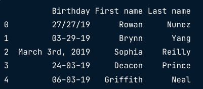

:PROPERTIES:
:ID:       50086988-bef5-40c4-acc1-204572b05996
:ROAM_ALIASES: Data Consistency
:END:
#+title: Data Uniformity
#+filetags: :Wrangling:
* Temperature Example
1. Plot data first to identify outliers
2. Handle outliers
#+begin_src python
# transform temperatures from Fahrenheit to Celsius if greater than 45 degrees Fahrenheit
temp_fah = temperatures.loc[temperatures['Temperature'] > 45, 'Temperature']
temp_cels = (temp_fah - 32) * 5/9
temperatures.loc[temperatures['Temperature'] > 45, 'Temperature'] = temp_cels

assert temperatures['Temperature'].max() <= 45
#+end_src

* Date Example

#+begin_src python
# Just for wierd date formats
birthdays['Birthday'] = pd.to_datetime(
    birthdays['Birthday'],
    # Attempt to infer format of each date
    infer_datetime_format=True,
    # Return NA for rows where conversion failed
    errors='coerce',
)
#+end_src
