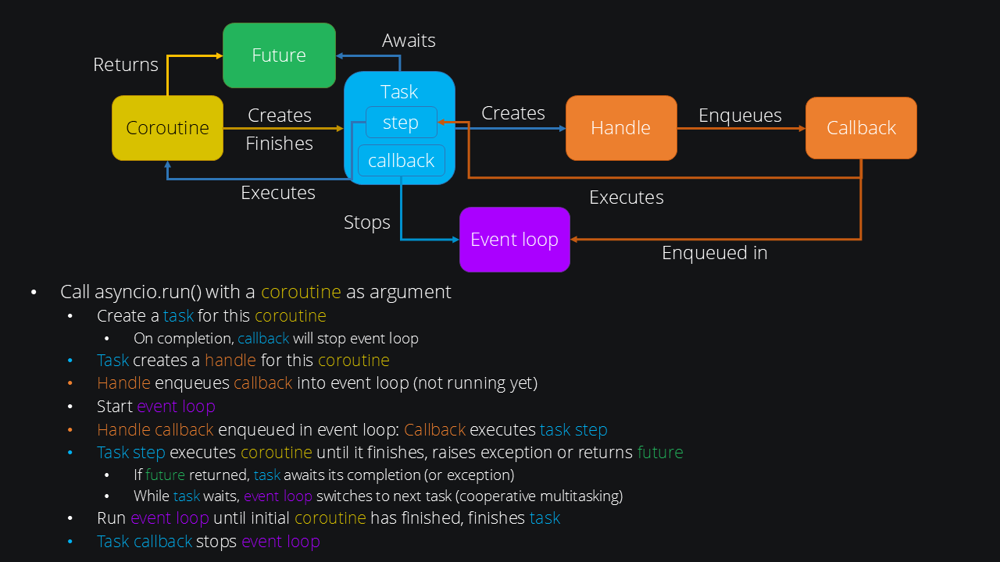

:PROPERTIES:
:ID:       48cbf16f-048a-4bd3-9561-4c4566f6b204
:END:
#+title: asyncio

* Overview

#+begin_src python :results output :session
import time
import asyncio

async def sleep(seconds):
    await asyncio.sleep(seconds)
    return seconds

async def main():
    print(f"started at {time.strftime('%X')}")
    result = await sleep(1)
    print(f"finished at {time.strftime('%X')}")

asyncio.run(main())
#+end_src

#+RESULTS:
: started at 15:43:49
: finished at 15:43:50

* ~asyncio.run()~
When ~signal.SIGINT~ is raised by =Ctrl-C=, the custom signal handler cancels the main task by calling ~asyncio.Task.cancel()~ which raises ~asyncio.CancelledError~ inside the main task. This causes the Python stack to unwind, ~try/except~ and ~try/finally~ blocks can be used for resource cleanup. After the main task is cancelled, ~asyncio.Runner.run()~ raises KeyboardInterrupt.

* Run Coroutines Concurrently
#+begin_src python :results output :session
async def main():
    async with asyncio.TaskGroup() as tg:
        task1 = tg.create_task(sleep(1))
        task2 = tg.create_task(sleep(2))
        task3 = tg.create_task(sleep(3))
        print(f"started at {time.strftime('%X')}")
    # The await is implicit when the context manager exits.
    print(f"finished at {time.strftime('%X')}")
    print(f"task3 result: {task3.result()}")

asyncio.run(main())
#+end_src
- [[https://docs.python.org/3/library/asyncio-task.html#task-groups][TaskGroup Docs]]

#+RESULTS:
: started at 15:45:45
: finished at 15:45:48
: task3 result: 3

* Awaitables
** Coroutines
- A coroutine function: an ~async def~ function;
- A coroutine object: an object returned by calling a coroutine function. ~coro = asyncio.sleep(5)~

** Tasks
- Tasks are used to schedule coroutines concurrently.
- When calls ~asyncio.create_task()~ the coroutine is automatically scheduled.

*** Cancellation
- When a task is canceled, ~asyncio.CancelledError~ will be raised in the task *at the next opportunity*.
  - If ~asyncio.CancelledError~ is *explicitly caught*, it should generally *be propagated when clean-up is complete*.
- It is recommended that coroutines use *try/finally blocks to robustly perform clean-up logic*.

** Futures
- Represents an *eventual* result of an asynchronous operation.
- When a Future object is awaited it means that the coroutine will wait until the Future is resolved in some other place.
- Future objects needed to allow *callback-based* code to be used with ~async/await~.

* Functions
- ~asyncio.sleep~: Setting the delay to 0 provides an optimized path to allow other tasks to run.
